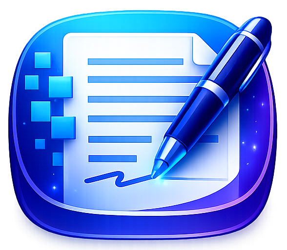

<p align="center">
  
</p>

# ByteDoc

**Version 0.0.8**

An offline-first technical document editor for writing structured, multi-section documents with professional DOCX export. All data is stored locally in the browser — no server, no account, no internet connection required.

---

## Overview

ByteDoc is designed for engineers and technical writers who need to produce polished Word documents from a distraction-free web editor. You write in a rich text environment, organise content into a nested section tree, and export to a fully styled `.docx` file driven by a reusable template system.

---

## Features

### Editor
- **Rich text editing** powered by TipTap — bold, italic, underline, strikethrough, subscript, superscript, highlight, text colour, font size, links
- **Block elements** — headings (H1–H4), paragraphs, bullet lists, ordered lists, blockquotes, code blocks, horizontal rules, images
- **Paragraph controls** — align text left, centre, right, or justified; increase or decrease paragraph and heading indentation
- **Tables** — insert tables from a single setup dialog with rows, columns, and optional header row; edit rows, columns, header cells, background colour, text colour, and line type from the toolbar
- **Page break** — insert a hard page break anywhere in the content via the toolbar
- **Citations** — inline `[n]` markers linked to a reference list
- **Footnotes** — inline superscript markers with footnote text
- **Figure captions** — auto-numbered, linked to the List of Figures on export
- **Table captions** — auto-numbered, linked to the List of Tables on export
- **Character count** — live count shown in the editor footer

### Document Structure
- **Sections** — nested tree of sections and sub-sections, drag-and-drop reorderable
- **Auto-numbering** — section headings are automatically numbered (`1`, `1.1`, `1.1.2`, …)
- **Multiple documents** — create and switch between independent documents; double-click a document name in the sidebar to open its settings directly
- **Document metadata** — title, subtitle, author, organisation, version, status (Draft / Review / Final), description/abstract

### Changelog
- Per-document changelog table with version, date, author, and description columns
- Optionally included on export as a front-matter section

### References
- Manage a bibliographic reference list per document
- Automatic `[n]` numbering on export
- References section always rendered on its own page at the end of the document

### DOCX Export
- **Template system** — create, duplicate, and manage multiple named export templates
- Per-template control over:
  - **Typography** — body and heading font families, body size, H1–H4 sizes
  - **Colours** — H1/H2 colour, H3/H4 colour, accent (links/citations), table header fill, table header text, table borders
  - **Page layout** — A4 or Letter, top/bottom/left/right margins
  - **Header & footer** — toggle visibility; footer shows document title · version on the left, page `n / total` on the right
  - **Front matter** — toggle title page, table of contents, changelog, list of figures, list of tables individually
  - **Color bar** — optional coloured bar across the top of body pages; on the title page it runs as a full-height vertical band on the left (25 % of page width), anchored to the physical page edge with no margin gap
  - **Title page logo** — upload an image (PNG, JPG, etc.) and position it upper-left, upper-right, or above the title
  - **Watermark** — stamp the document status (Draft / Review / Final) diagonally across every page at 64 pt; visibility adjustable from 1 (faint) to 100 (solid)
- **Active template** — one template is marked active and used for every export; switchable from the template manager or the export dialog
- **Inline and table formatting export** — editor font-size selections, paragraph/heading indentation, and table cell colours/line styles are preserved in generated DOCX files

### Interface
- **Dark / light mode** — toggle in the top-right corner, persisted across sessions
- **Two-level sticky toolbar** — application menus (`File`, `Edit`, `Insert`, `Format`, `Table`, `Tools`, `View`) sit above grouped formatting controls with style, colour, alignment, list, insert, table grid, undo, and redo tools
- **Context-aware table toolbar** — table row/column, header, colour, and line controls appear only while editing inside a table
- **Offline-first** — all documents, sections, references, changelog entries, and templates are stored in IndexedDB via Dexie; nothing leaves the browser

---

## Tech Stack

| Layer | Library |
|---|---|
| Framework | React 18 + TypeScript |
| Build | Vite 5 |
| Editor | TipTap 2 |
| Storage | Dexie 4 (IndexedDB) |
| State | Zustand 5 |
| Export | docx 8 + file-saver |
| Drag & drop | dnd-kit |
| Syntax highlight | lowlight + highlight.js |
| Icons | lucide-react |
| Styles | Tailwind CSS 3 |

---

## Getting Started

### Docker (recommended)

The fastest way to run ByteDoc. Requires [Docker](https://docs.docker.com/get-docker/) with Compose v2.

```bash
git clone <repo>
cd ByteDoc

# First run — build the image and start
./start-docker.sh start --build

# Subsequent runs
./start-docker.sh start

# Follow logs while running
./start-docker.sh start --logs

# Stop
./start-docker.sh stop
```

ByteDoc opens at **http://localhost:3019**.

To use a different port:

```bash
PORT=8080 ./start-docker.sh start --build
```

Or copy `.env.example` to `.env` and edit:

```bash
cp .env.example .env
# edit PORT= in .env
./start-docker.sh start --build
```

#### Makefile shortcuts

```bash
make build     # Build the image
make up        # Start (detached)
make down      # Stop
make logs      # Follow logs
make ps        # Show container status
make restart   # Restart the container
make clean     # Stop and remove volumes
```

---

### Local development

#### Prerequisites

- Node.js 18 or later
- npm

#### Install

```bash
git clone <repo>
cd ByteDoc
npm install
```

#### Development server

```bash
npm run dev
# or
make dev
```

Opens at `http://localhost:5173`.

#### Production build

```bash
npm run build
npm run preview
```

#### Type check

```bash
npm run typecheck
```

---

## Project Structure

```
src/
├── components/
│   ├── layout/
│   │   ├── AppShell.tsx          # Root layout, toolbar, sidebar, modal router
│   │   └── EditorArea.tsx        # TipTap editor wrapper
│   └── modals/
│       ├── DocumentSettingsModal.tsx   # Title, author, version, status
│       ├── ExportModal.tsx             # Template picker + export trigger
│       ├── ReferenceModal.tsx          # Add / edit references
│       ├── TemplateSettingsModal.tsx   # Full template editor
│       └── Modal.tsx                   # Base modal shell
├── db/
│   └── index.ts                  # Dexie schema (v1 → v2 migration)
├── editor/
│   ├── extensions/               # Custom TipTap extensions
│   │   ├── Citation.ts
│   │   ├── FontSize.ts
│   │   ├── Footnote.ts
│   │   ├── FigureCaption.ts
│   │   ├── Indent.ts
│   │   ├── TableCaption.ts
│   │   ├── TableCellStyle.ts
│   │   ├── PageBreak.ts
│   │   └── index.ts
│   └── Toolbar.tsx               # Editor toolbar component
├── lib/
│   ├── export.ts                 # DOCX generation (docx library)
│   └── numbering.ts              # Section tree builder + auto-numbering
├── store/
│   ├── documentStore.ts          # Active document + sections state
│   ├── templateStore.ts          # Templates CRUD + active template
│   └── uiStore.ts                # Modal state + theme toggle
└── types/
    ├── document.ts               # ByteDocument, Section, ChangelogEntry
    ├── reference.ts              # Reference, FootnoteData
    ├── template.ts               # DocxTemplate, DEFAULT_TEMPLATE
    └── computed.ts               # SectionNode (tree node type)
```

---

## Data Model

All data lives in IndexedDB under the `ByteDocDB` database (Dexie schema v2).

| Table | Key | Description |
|---|---|---|
| `documents` | `id` | Document metadata |
| `sections` | `id` | Section content (TipTap JSON) |
| `references` | `id` | Bibliographic references |
| `footnotes` | `id` | Footnote text |
| `changelog` | `id` | Changelog entries |
| `templates` | `id` | Export templates |

---

## Export Architecture

`src/lib/export.ts` builds the DOCX document in memory and triggers a browser download via `file-saver`. The pipeline:

1. Build the section tree and flatten it for numbering
2. Build caption number maps (figures, tables)
3. Assemble front-matter sections (title page, TOC, changelog, list of figures, list of tables)
4. Convert each section's TipTap JSON to `docx` Paragraph/Table objects
5. Append the references list (always on its own page)
6. Apply template styles (fonts, colours, page size, margins)
7. Construct DOCX sections:
   - **Color bar enabled**: title page in its own section (floating table anchored to page origin); frontmatter section; body section with `header: 0` margin so the bar paragraph bleeds to the physical top edge
   - **Color bar disabled**: combined frontmatter section; body section
8. Pack and save as `<title>-v<version>.docx`

---

## License

MIT — see [LICENSE](LICENSE).
